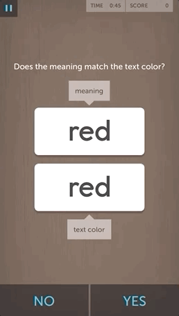

# Final project - Brain Games

## Description
With your knowledge about Swift and iOS, your goal for this project will be to build a functional app.
This should be a learning experience and a challenge to prove how far you've come during this course.

You will be building a Brain Training app! 🧠💪🏼 
Training our brains is a great way to keep our minds active, improve our memory and attention.
To read more about how research supports this, I encourage you to read [this article](https://www.apa.org/monitor/2014/10/mind-games).

The game required for this project is a Color Matching game 🌈 
Users are shown words of colors (one below the other) and need to identify if the text in the upper word matches the color of the word at the bottom. 
This is usually an exercise to demonstrate the [Stroop Effect](https://en.wikipedia.org/wiki/Stroop_effect).
And one of its goals is to help with reaction time.

An example of implementation [here](https://www.lumosity.com/en/brain-games/color-match/).

## Learning Outcomes
By completing this project, you should be able to…

1. Demonstrate proficiency using Swift's basic building blocks.
1. Follow a set of requirements to build a product.
1. Build an app with Xcode that users can interact with.
1. Run the final version of the app in a real device.

## Schedule
From the day this project is assigned, you will have **3 weeks** to complete this project. A sample daily outline is provided to assist you in planning your project.

**Important note:** “Week 1” refers to the first calendar week of the project being assigned, and subsequent weeks will follow this reference:

- Week 1: Project assigned, read the project spec, ask any clarifying questions you may have, design how you would implement the project and start the basic UI
- Week 2: Build out main functionality (game mechanics) and hook up UI
- Week 3: Testing, fix any remaining bugs, make sure your code has helpful comments, and submit the project!

## Requirements

1. Users are shown two words with the name of a color (words are colored).
1. Users are asked if the text of first word matches the color in the second word.
1. Users select an answer: yes or no.
1. Users get 10 points if they are correct, they get 10 points less if they're wrong.
1. Users can see a score in the screen.
1. Users go on for 60 seconds before the game ends.
1. Users can restart the game.
1. You can either use SpriteKit or UIKit for the project. (UIKit is advised)
1. Use Swift's basic building blocks
	-	variables & constants
	- custom types (classes, structs or enums)
	- functions
	- control flow
1. Version control with Github

### Stretch Requirements/Challenges

1. With the same game:
	- Make correct answers cumulative and show the user their streak!

1. Extend your Brain Trainer to include one or more mini games!
	- Add another variation of the Stroop Effect game.
		- Examples to get inspiration:
			- [Color world](https://apps.apple.com/us/app/color-word-match/id1369388320)
			- [Color switch](https://apps.apple.com/us/app/colorswitch/id923653602)
			- [Stroopid](https://apps.apple.com/us/app/stroopid/id1254974957)

	- Game Add-1: Users have to add 1111 to a random number between 1000 and 8888.
		- [Add-1](https://apps.apple.com/us/app/add1/id1469416958)

	- A game of your own creation.

## Rubric
Find the rubric named: MOB 1.1 - Final Project [here]()

## Resources
Additional resources that will help with this project, or that can be used as reference

- [A guide to timers in Swift](https://learnappmaking.com/timer-swift-how-to/)

## Commit Requirements
**All projects will require a minimum of 10 commits, and must take place throughout the entirety of the course**

- **Good Example:** 40+ commits throughout the length of the project, looking for a healthy spattering of commits each week (such as 3-5 per day).
- **Bad Example:** 10 commits on one day during the course and no others. Students who do this will be at severe risk of not passing the class.
- **Unacceptable Example:** 2 commits the day before a project is due. Students who do this should not expect to pass the class.

### Why are we doing this?
We want to encourage best practices that you will see working as a professional software engineer. Breaking up a project by doing a large amount of commits helps engineers in the following ways:

- It's much easier to retrace your steps if you break your project/product/code up into smaller pieces
- It helps with being able to comprehend the larger problem, and also will help with your debugging (i.e. finding exactly when you pushed that piece of broken code)
- It allows for a more streamlined, iterative communication in your team, as it's much easier to hand off a small change to someone (updating a function) than a huge one (changed the architecture of the project)

Through this requirement, we hope to encourage you to think about projects with an iterative, modular mindset. Doing so will allow you to break projects down into smaller milestones that come together to make your fully-realized solution.
