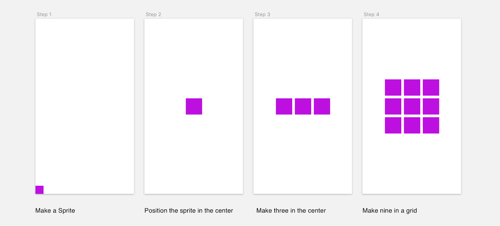

# Introduction to SpriteKit

## Minute-by-Minute

| **Time(min)** | **Activity**                             |
| ------------- | ---------------------------              |
| 5             | Intro & Objectives                       |
| 10            | What is SpriteKit?                       |
| 20            | Activity: Discovering SpriteKit elements |
| 10            | Reinforce concepts                       |
| 10            | Break                                    |
| 45            | Activity: The Grid                       |
| 5             | Wrap up & Q&A                            |

## Class Learning Objectives/Competencies
By the end of this lesson, students should be able to:

- Setup an Xcode Game Project
- Identify the user interface elements of Xcode needed to build and run an iOS Game
- Identify and use SpriteKit to build and run a simple project
- Place assets and views on a screen
- Describe how the rendering loop works

## Overview

Slides: [Building an iOS Game](https://docs.google.com/presentation/d/17AR52Hkqp1Lid4BohnvcHnZJ5cK3w1j7yusMJQkaRKI/edit?usp=sharing)

## In Class Activities

[Empty Starter project](https://github.com/Product-College-Labs/Game-Starter-Empty/tree/master)

Using what you already know, complete each step in the image to build a grid. Try using loops for the final result.

## Wrap Up
- Start Tutorial: [Orange Tree](https://www.makeschool.com/academy/track/learn-to-clone-angry-birds-with-spritekit-and-swift-4)

## Additional Resources
- [Article - Quick Intro to SpriteKit](https://hackernoon.com/swift-spritekit-basics-94b1798ab639)
- [A more detailed Explanation of SpriteKit](https://code.tutsplus.com/tutorials/introducing-spritekit--cms-28648)
