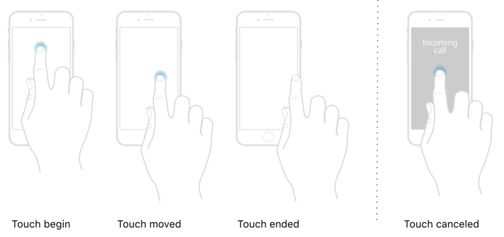

<!-- Run this slideshow via the following command: -->
<!-- reveal-md README.md -w -->

<!-- .slide: class="header" -->
# Building an iOS game

## [Slides](https://make-school-courses.github.io/MOB-1.1-Introduction-to-Swift/Slides/06-Building-an-iOS-Game/README.html ':ignore')

<!-- > -->

## Agenda

- Quiz 🤓
- SKLabel
- Touch events with SpriteKit
- Finding & removing nodes
- Game mechanics

<!-- > -->

## Quiz

<!--- https://docs.google.com/document/d/1eUn07IC0Njl8XVVjjzaq_jTJNJtXd7Jk7XglhL8W5Pk/edit?usp=sharing -->

- **15 min** Answer quiz
- **10 min** Exchange with a partner and grade as the whole class goes through the answers

<!-- > -->

## Learning Objectives
By the end of this lesson, students should be able to:

- Add labels to show game progress
- Delete sprites from scenes using `RemoveFromParent`
- Find sprites by their name property
- Add game mechanics to the game

<!-- > -->

## SKLabel

`SKLabelNode` class is a fast and efficient way to draw text in SpriteKit games.

- Show current score
- Show instructions
- Game over messages
- Next level messages
- Everything that can be a text 🔤

<!-- v -->

```swift
var currentScore: SKLabelNode!
currentScore = SKLabelNode(fontNamed: "Helvetica")
currentScore.text = "Score: 0"
currentScore.horizontalAlignmentMode = .left
currentScore.position = CGPoint(x: 20, y: 100)
addChild(currentScore)
```

<!-- v -->

```swift
var score: Int = 0 {
    didSet {
        currentScore.text = "Score: \(score)"
    }
}
```

<aside class="notes">
Here we use a property observer to update the label when the score changes. We'll see more about properties when we get to OOP.

The starter code doesn't have this approach. Try to implement it!
</aside>

<!-- > -->

## Touch events

How can we make the player interact with our game?

We need to handle user actions - using gyroscope, touch events, camera, microphone.

We'll learn about touch events.



<!-- v -->

### touchesBegan

To register event handlers, we need the method `touchesBegan`.

```swift
override func touchesBegan(_ touches: Set<UITouch>, with event: UIEvent?) {}
```

And then what? For our specific purpose in the game, we want to see if there is a node where we tapped.

<!-- v -->

### Finding nodes

We need to have a way to find and identify the nodes.

We can use `name` property! Search the node tree for a node with a specific name.

`childNode(withName:)` - searches the children of a node for a specific name<br>
`enumerateChildNodes(withName:using:)` - searches a node's children and calls the block once for each match found.<br>
`subscript(_:)` - returns an array of nodes that match the name<br>
`atPoint( location:CGPoint)` - returns the node at the location<br>

<!-- v -->

## Combining nodes and touches

1. Get the `touchLocation` within the scene from the `location` property of the touch.

2. Figure out which node was touched by invoking `atPoint(_:)` and passing in the `touchLocation`.

3. Check if name matches the string.

<!-- v -->

```swift
override func touchesBegan(_ touches: Set<UITouch>, with event: UIEvent?) {
  if let touch = touches.first {
      let touchLocation = touch.location(in: self)
      let node = atPoint(touchLocation)
      if node.name == "square" {
         // Do something
      }
  }
}
```

<!-- > -->

## Removing nodes

Now that we can identify nodes by their names using `name` property, we can use it to remove nodes from the scene.

- If they go off screen and are no longer visible. 👻
- If they should disappear after we tap on them. 💥

`removeFromParent` - Creates an action that removes the node from its parent.

```swift
node.removeFromParent()
```

<!-- > -->

## Exploring SpriteKit

SpriteKit has many tools we can use to make games. We've learned the basics to build a functional, simple but still engaging game.

More things available if curious:

- Physics with SpriteKit
- SKActions for sound effects
- Particle systems
- Using core motion
- Many more...

<!-- > -->

## For the rest of today's lesson

See how far into the development of your game you can get. We are missing game mechanics.

It should have **at least** the following:

<!-- v -->

- Nodes at random x-positions that move all the way across the screen.
- Nodes should be removed if they reach the edge or if a user taps on them.
- Keeping score: tapped nodes add 1 point, nodes that reach the top decrease score by one (or your scoring system of preference).
- Showing & updating the score with a label.
- Game conditions to end the game (example: if score is < 0).
- Showing a message when the game ends.
- Restarting the game.

<!-- > -->

## After Class

- Complete today's activities.
- Continue tutorial: [Sushi Neko](https://www.makeschool.com/academy/track/learn-to-clone-timberman-with-spritekit-and-swift-4) (we well go over it next class to check on doubts and progress)
- Finish your game implementation. It will be graded later in the course with [this rubric](https://docs.google.com/document/d/1JEKPGv1ve1Zoq246WEgb9N8WuNkcWasjqnp3CF3kY_g/edit?usp=sharing). Check the due date in the main page of the course.
